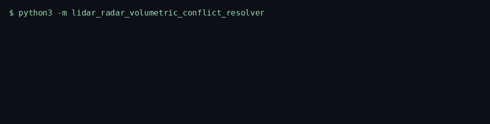
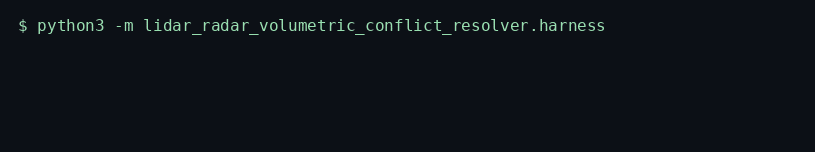
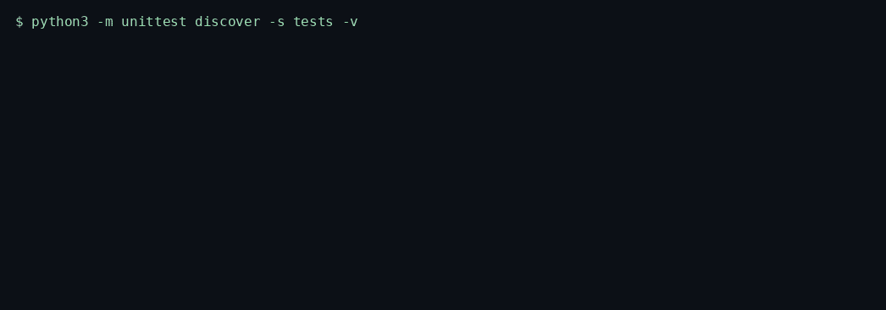

# LiDAR Radar Volumetric Conflict Resolver

> Associates lidar clusters with radar tracks inside a distance gate and withholds the pair when both confidences are low or the range rates disagree.

<p>
  <a href="https://github.com/TechieGoku2623/lidar-radar-volumetric-conflict-resolver/actions/workflows/ci.yml"></a>
  
  
</p>

| | |
| --- | --- |
| **Website** | https://github.com/TechieGoku2623/lidar-radar-volumetric-conflict-resolver |
| **Topics** | `python` `asyncio` `autonomous-vehicles` `lidar` `radar` `sensor-fusion` |

## Walkthrough

Three recordings from this repository. Each one is the command in the frame, not a drawing.

### Engine

`python3 -m lidar_radar_volumetric_conflict_resolver`



A lidar return with no radar partner is a dropout. Two tracks in one cell with contradictory velocities are a conflict, not a blended ghost.

### Benchmark

`python3 -m lidar_radar_volumetric_conflict_resolver.harness`



5000 iterations after 20 warmup, seed 26262. One agreeing pair. The frame ends on the status line and `echo $?`.

### Tests

`python3 -m unittest discover -s tests -v`



Wire round-trip, the happy path, and both edge cases below.

## Pipeline

```
lidar list     radar list
  |              |
  v              v
predict radar on range rate
  |
  v
gated nearest neighbor
  |
  +--> no partner -----------> dropout
  +--> range-rate conflict --> conflict
  +--> both confidences low -> withhold
  +--> else -----------------> confidence-weighted position
  v
{fused, withheld, dropouts, conflicts}
```

## Quick start

```bash
python3 -m venv venv
source venv/bin/activate
pip install -e ".[dev]"
python -m lidar_radar_volumetric_conflict_resolver
python -m lidar_radar_volumetric_conflict_resolver.harness
python -m unittest discover -s tests -v
```

Python 3.12. The runtime is the standard library. `black` and `flake8` are the `dev` extra.

## Use it

```python
import asyncio

from lidar_radar_volumetric_conflict_resolver import (
    LidarRadarVolumetricConflictResolver,
)


async def demo() -> None:
    resolver = LidarRadarVolumetricConflictResolver(arena_m=200.0, dt_s=0.05)
    await resolver.run(
        [
            {
                "sensor": "lidar",
                "x": 12.0,
                "y": -4.0,
                "z": 0.5,
                "range_rate": 6.0,
                "confidence": 0.82,
            },
            {
                "sensor": "radar",
                "x": 12.3,
                "y": -3.9,
                "z": 0.45,
                "range_rate": 6.2,
                "confidence": 0.70,
            },
        ]
    )


asyncio.run(demo())
```

## Bounds

| | |
| --- | ---: |
| Iterations | 5000 |
| Average | 303.049 µs |
| P99 | 468.791 µs |
| tracemalloc peak | 176413 bytes |

Figures are from the harness on the machine that published them. A later host moves the microseconds. The pass/fail result does not.

## What it refuses

- A non-finite coordinate, or a point outside the 200 m arena, raises `EngineKernelException`.
- Lidar with no radar partner inside the gate is reported as a dropout. Low confidence on both sensors withholds the track.

The two sensor lists stay separate until one merge step, in the spirit of ISO 26262 freedom from interference. No ASIL claim.

## Tree

```
src/lidar_radar_volumetric_conflict_resolver/
  engine.py       kernel
  wire.py         struct frames
  harness.py      benchmark
  __main__.py     demo entry
tests/test_engine.py
Dockerfile        non-root, uid 10001
```
